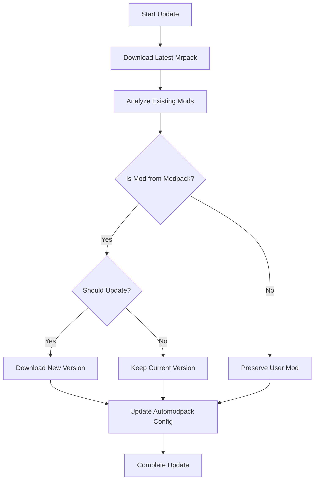

# 🚀 Minecraft Updater - Electron Integration Guide

The Minecraft Updater is a specialized tool designed to work seamlessly with Electron applications. It scans for existing Minecraft instances across all supported launchers and intelligently updates mods without replacing user-added content.

## ✨ Key Features

- **🔍 Instance Scanning**: Automatically detects instances from all supported launchers
- **🧠 Smart Mod Updates**: Only updates modpack mods, preserves user mods
- **🔗 Automodpack Integration**: Updates server configurations and fingerprints
- **📊 JSON Output**: Perfect for Electron app integration
- **🎯 Selective Updates**: Update specific instances or all instances of a type

## 🎮 Supported Launchers

| Launcher               | Detection | Mod Updates | Automodpack |
| ---------------------- | --------- | ----------- | ----------- |
| **AstralRinth**        | ✅ Full   | ✅ Smart    | ✅ Full     |
| **ModrinthApp**        | ✅ Full   | ✅ Smart    | ✅ Full     |
| **XMCL**               | ✅ Full   | ✅ Smart    | ✅ Full     |
| **PrismLauncher**      | ✅ Full   | ✅ Smart    | ✅ Full     |
| **Official Minecraft** | ✅ Full   | ✅ Smart    | ✅ Full     |

## 🛠️ Installation

The updater is included as a separate binary in the minecraft-installer package:

```bash
# Build the updater
cargo build --release --bin minecraft-updater

# The binary will be at: target/release/minecraft-updater
```

## 📋 Usage

### Command Line Interface

```bash
# Scan all instances and return JSON
minecraft-updater scan --format json

# Update a specific instance
minecraft-updater update --instance-path "/path/to/instance" --modpack-type neoforge

# Update all instances of a specific type
minecraft-updater update-all --modpack-type fabric
```

### Electron Integration

```javascript
const { MinecraftUpdaterIntegration } = require('./electron-integration.js')

const updater = new MinecraftUpdaterIntegration()

// Scan all instances
const instances = await updater.scanInstances()

// Update a specific instance
const result = await updater.updateInstance('/path/to/instance', 'neoforge')

// Update all NeoForge instances
const results = await updater.updateAllInstances('neoforge')
```

## 📊 Instance Information Structure

Each instance returns detailed information:

```json
{
  "name": "NAHA-NeoForge",
  "launcher_type": "AstralRinth",
  "launcher_path": "/Users/user/AppData/Roaming/AstralRinthApp",
  "instance_path": "/Users/user/AppData/Roaming/AstralRinthApp/profiles/naha-neoforge",
  "minecraft_version": "1.21.1",
  "mod_loader": "NeoForge",
  "mod_loader_version": "21.1.209",
  "mod_count": 45,
  "mods": [
    {
      "name": "sodium",
      "filename": "sodium-0.5.8.jar",
      "version": "0.5.8",
      "mod_id": "sodium",
      "is_user_mod": false,
      "file_size": 1234567,
      "last_modified": "2025-09-25T10:30:00Z"
    }
  ],
  "has_automodpack": true,
  "server_info": {
    "server_ip": "play.naha.com",
    "server_port": 25565,
    "fingerprint": "abc123...",
    "server_name": "NAHA Server"
  },
  "last_updated": "2025-09-25T10:30:00Z"
}
```

## 🔄 Update Process

### Smart Mod Detection

The updater intelligently categorizes mods:

1. **Modpack Mods**: Mods that are part of the official modpack
   - These get updated when newer versions are available
   - Examples: Sodium, Iris, Fabric API, NeoForge

2. **User Mods**: Mods added by the user
   - These are preserved and never replaced
   - Examples: Custom shaders, personal mods, client-side additions

### Update Logic



### Automodpack Integration

The updater automatically updates:

- **`automodpack-known-hosts.json`**: Server fingerprints and IPs
- **`servers.dat`**: Server list (when possible)
- **Server configuration**: Latest server information from API

## 🎯 Electron App Integration

### Basic Setup

```javascript
// main.js (Electron main process)
const { MinecraftUpdaterIntegration } = require('./electron-integration.js')

class MinecraftManager {
  constructor() {
    this.updater = new MinecraftUpdaterIntegration()
  }

  async getInstances() {
    try {
      return await this.updater.scanInstances()
    } catch (error) {
      console.error('Failed to scan instances:', error)
      return []
    }
  }

  async updateInstance(instancePath, modpackType) {
    try {
      return await this.updater.updateInstance(instancePath, modpackType)
    } catch (error) {
      console.error('Failed to update instance:', error)
      throw error
    }
  }
}
```

### React Component Example

```jsx
// InstanceList.jsx
import React, { useState, useEffect } from 'react'

const InstanceList = () => {
  const [instances, setInstances] = useState([])
  const [loading, setLoading] = useState(true)

  useEffect(() => {
    loadInstances()
  }, [])

  const loadInstances = async () => {
    try {
      const {
        MinecraftUpdaterIntegration,
      } = require('./electron-integration.js')
      const updater = new MinecraftUpdaterIntegration()
      const instances = await updater.scanInstances()
      setInstances(instances)
    } catch (error) {
      console.error('Failed to load instances:', error)
    } finally {
      setLoading(false)
    }
  }

  const updateInstance = async (instancePath, modpackType) => {
    try {
      const {
        MinecraftUpdaterIntegration,
      } = require('./electron-integration.js')
      const updater = new MinecraftUpdaterIntegration()
      const result = await updater.updateInstance(instancePath, modpackType)

      if (result.success) {
        alert(`Successfully updated ${result.updated_mods.length} mods!`)
        loadInstances() // Refresh the list
      } else {
        alert(`Update failed: ${result.message}`)
      }
    } catch (error) {
      alert(`Error: ${error.message}`)
    }
  }

  if (loading) return <div>Loading instances...</div>

  return (
    <div>
      <h2>Minecraft Instances ({instances.length})</h2>
      {instances.map((instance, index) => (
        <div key={index} className="instance-card">
          <h3>{instance.name}</h3>
          <p>Launcher: {instance.launcher_type}</p>
          <p>Minecraft: {instance.minecraft_version}</p>
          <p>Mod Loader: {instance.mod_loader}</p>
          <p>Mods: {instance.mod_count}</p>
          {instance.has_automodpack && <p>🔗 Automodpack Enabled</p>}

          <div className="actions">
            <button
              onClick={() => updateInstance(instance.instance_path, 'neoforge')}
              disabled={!instance.mod_loader.toLowerCase().includes('neoforge')}
            >
              Update NeoForge
            </button>
            <button
              onClick={() => updateInstance(instance.instance_path, 'fabric')}
              disabled={!instance.mod_loader.toLowerCase().includes('fabric')}
            >
              Update Fabric
            </button>
          </div>
        </div>
      ))}
    </div>
  )
}

export default InstanceList
```

## 🔧 Advanced Features

### Batch Updates

```javascript
// Update all instances of a specific type
const updateAllNeoForge = async () => {
  const { MinecraftUpdaterIntegration } = require('./electron-integration.js')
  const updater = new MinecraftUpdaterIntegration()

  const results = await updater.updateAllInstances('neoforge')

  const successful = results.filter((r) => r.success).length
  const failed = results.filter((r) => !r.success).length

  console.log(`Updated ${successful} instances, ${failed} failed`)
}
```

### Progress Tracking

```javascript
// Track update progress
const updateWithProgress = async (instancePath, modpackType, onProgress) => {
  const { MinecraftUpdaterIntegration } = require('./electron-integration.js')
  const updater = new MinecraftUpdaterIntegration()

  onProgress('Starting update...')

  try {
    const result = await updater.updateInstance(instancePath, modpackType)

    if (result.success) {
      onProgress(
        `Updated ${result.updated_mods.length} mods, added ${result.new_mods.length} new mods`,
      )
    } else {
      onProgress(`Update failed: ${result.message}`)
    }

    return result
  } catch (error) {
    onProgress(`Error: ${error.message}`)
    throw error
  }
}
```

## 🐛 Troubleshooting

### Common Issues

1. **"No instances found"**
   - Ensure launchers are properly installed
   - Check that instances exist in expected directories
   - Verify launcher detection logic

2. **"Update failed"**
   - Check internet connection for API access
   - Verify instance directory permissions
   - Ensure modpack type matches instance mod loader

3. **"User mods replaced"**
   - This shouldn't happen with the smart detection
   - Check mod naming patterns
   - Verify `is_user_mod` logic

### Debug Mode

```bash
# Enable verbose logging
RUST_LOG=debug minecraft-updater scan --format pretty
```

## 📈 Performance

- **Scanning**: ~1-2 seconds for 10+ instances
- **Updates**: ~30-60 seconds per instance
- **Memory**: ~50MB during operation
- **Disk**: Minimal temporary files

## 🔮 Future Enhancements

- [ ] GUI interface for standalone use
- [ ] Mod version comparison
- [ ] Backup and restore functionality
- [ ] Custom modpack support
- [ ] Update scheduling
- [ ] Conflict resolution

---

**Ready to integrate?** Check out the `electron-integration.js` file for a complete Node.js wrapper, or use the command-line interface directly in your Electron app!


